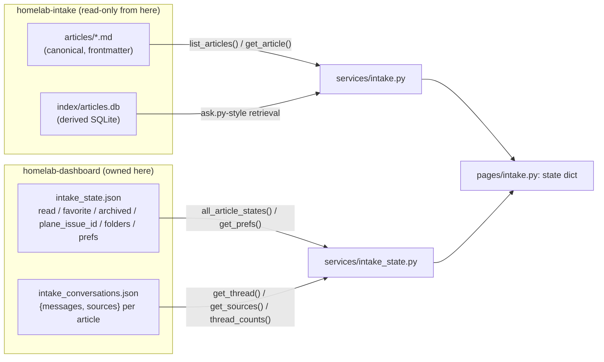
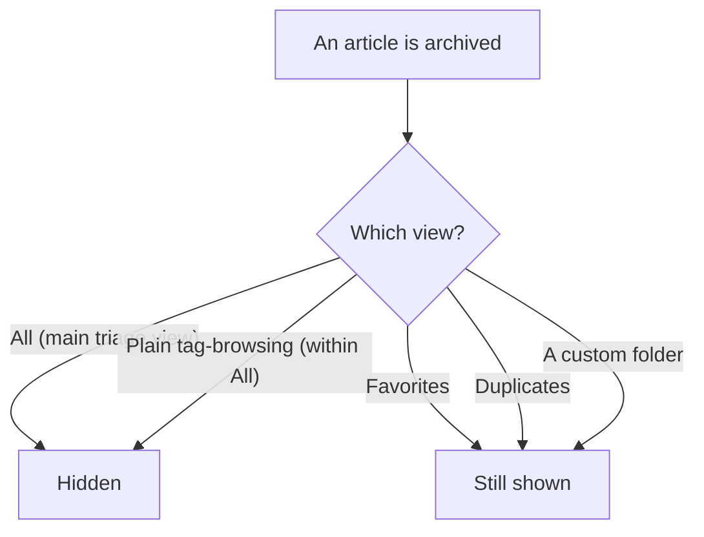
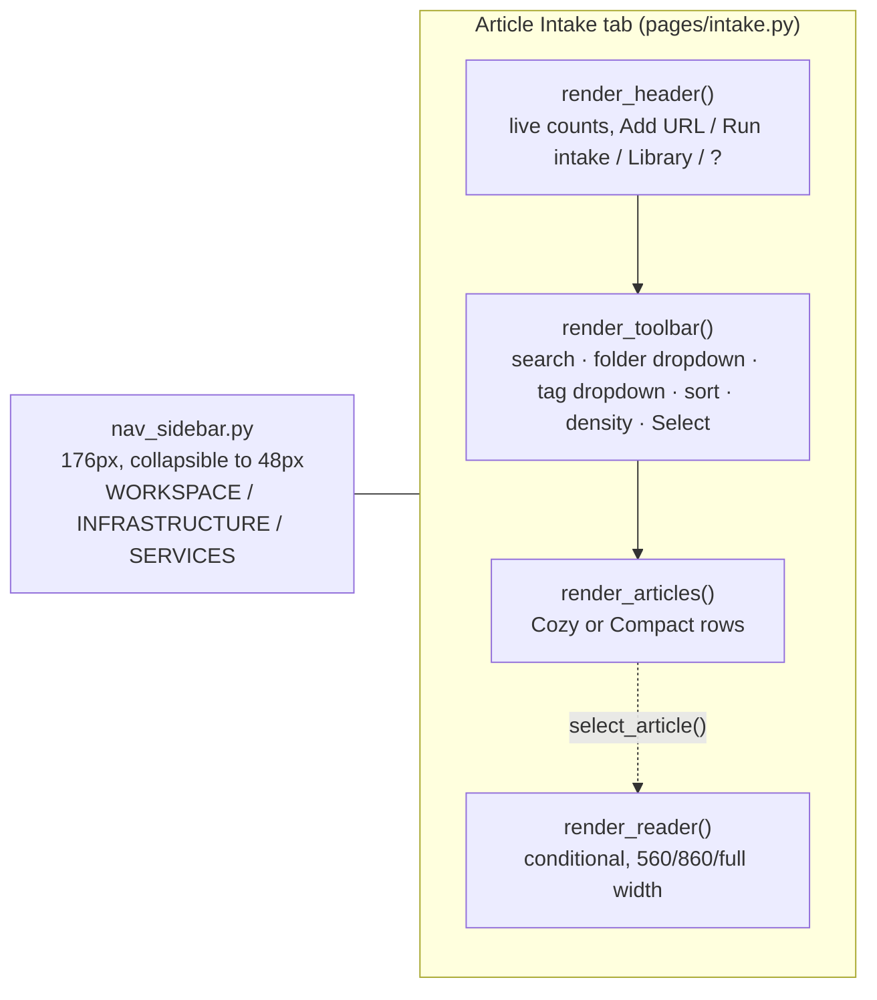
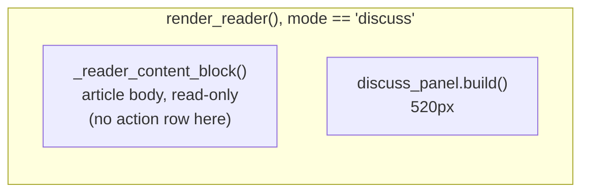

# Article Intake — Architecture Reference

Ground-truth map of how the Article Intake tab actually behaves, read directly out of
`pages/intake.py`, `components/discuss_panel.py`, `components/nav_sidebar.py`,
`components/layout.py`, `services/intake.py`, `services/intake_state.py`, and
`services/ai/discuss.py`. First written 2026-07-31 against a bug-fix pass on the
original design; **rewritten the same day** after a full visual + light-backend
rebuild ("Design v2") replaced most of what that first version described. This is
the current version — nothing below should be read as "planned," it's all live.

Companion docs: `DESIGN_BRIEF.md` (whole-dashboard product context, its Article
Intake section is explicitly superseded — see the note there), `INTAKE_UPGRADE_BRIEF.md`
(the functional brief this rebuild was designed against — now stale on layout specifics
since the rebuild deliberately departed from it in several places, still accurate on
data shapes), `IMPLEMENTATION_GUIDE.md` (service-layer contracts).

> **Keeping this current**: if `pages/intake.py`'s state shape or filter/render
> functions change shape again, regenerate this from source rather than hand-editing
> it — that's what keeps it trustworthy.

---

## 1. What changed in the Design v2 rebuild (context for everything below)

Chris showed Claude Design a screenshot of the real running app and said the global
nav + Article Intake's own rail together ate "half the screen" and needed a full
rewrite, not a patch. The result:

- **The global app nav and Article Intake's own rail merged into one.** There is no
  longer an Article-Intake-specific rail at all — `components/nav_sidebar.py` (shared
  by all 6 tabs) now renders three labeled groups (WORKSPACE / INFRASTRUCTURE /
  SERVICES), and categories/folders/tags moved into this tab's own toolbar as
  dropdowns instead of occupying a second rail.
- **Categories are gone.** All/Homelab/News/Errors no longer exist as a filter axis —
  `category` is inert now. Duplicates get their own dropdown entry; permanently-failed
  queue items stay in the existing queue panel (unaffected).
- **Cards/table view replaced by Cozy/Compact density.** Table view, and the two
  icon-only sort headers that existed only to reach modes the table's labeled headers
  couldn't, are deleted entirely — not hidden, removed.
- **The reader is conditional and resizable**, not a permanent pane with an empty
  state: hidden until an article is open, then 560px → 860px → full-width (list
  hidden), with prev/next navigation.
- **Discuss mode is a real split** (article left, chat right) instead of swapping the
  whole pane, and repo grounding became an explicit opt-in with a scope-disclosure
  popover instead of an always-available toggle.
- **Archiving semantics were redefined** — see §3, this is the load-bearing decision
  behind several other changes.

---

## 2. Where the data actually lives



`intake_conversations.json`'s shape changed: `{article_id: {"messages": [...],
"sources": {"archive": bool, "repos": [str]}}}` — `sources` is new, holding each
conversation's own Discuss grounding choices (previously a single in-memory set
shared across every article in the browser session, which meant toggling Repo off on
one article silently carried over to the next one you opened — fixed as a side effect
of persisting this per-article). Old bare-list-shaped entries are normalized on read
and rewritten in the new shape on next write — see `intake_state._normalize_conversation()`.

`intake_state.json`'s `prefs` changed from `{"view": "cards"|"table", "sort": ...}` to
`{"density": "cozy"|"compact", "sort": ...}`, default sort is now `unread` (was `date`).

Both `services/intake.py`'s `queue.json` and `services/intake_state.py`'s two files
have `fcntl`-locked, atomic (temp file + `os.replace`) read-modify-write — added
2026-07-31 after a bug-fix pass and an Agy review both found the same race class.
`homelab-intake/intake_daemon.py` still lacks the matching lock on `queue.json`;
tracked in that repo's `TODO.md`, not fixed here (cross-repo, out of scope).

---

## 3. Archiving semantics — the central design decision

Discussed at length with Chris before building: tags describe content and never
remove anything from view; **archived is the only mechanism that shrinks the working
set**, so it's a triage-completion flag, not a location and not redundant with
tagging. Resolved model:



- **All** and plain tag-browsing hide archived articles (and duplicates — see §4) —
  this is the only "triage queue" view.
- **Favorites** and **Duplicates** are deliberate, independent collections and
  **ignore archived state entirely** — an article you favorited that later got
  auto-archived (e.g. by Send to HomeLab) must not silently vanish from Favorites;
  a duplicate is a data-quality flag unrelated to triage progress.
- **Custom folders** get the same treatment as Favorites (filing something into a
  folder is the same kind of deliberate act as favoriting it).
- **Read/Unread stays separate from Archived** — read is a lightweight "seen it" cue
  that never removes anything from view; archived is the actual "done with it" action.
- Search and tag-filtering need no special-casing for any of this — both run through
  whichever folder-scoping the current view already applies, so a view's
  archived-inclusion rule automatically extends to searching/tagging within it.
- **No more "include archived" checkbox.** Archived is just one more entry in the
  folder/status dropdown (`STATUS_ENTRIES` in `pages/intake.py`), same level as
  All/Favorites/Duplicates/a custom folder — not a layered toggle on top of everything
  else.

Implemented in `_folder_scoped_articles()`:
```python
if folder == 'archived':   return [a for a in arts if _wf(a['id'])['archived']]
if folder == 'favorites':  return [a for a in arts if _wf(a['id'])['favorite']]         # includes archived
if folder == 'duplicates': return [a for a in arts if a['is_duplicate']]                # includes archived
if folder.startswith('custom:'): return [a for a in arts if name in a['user_folders']]  # includes archived
# 'all':
return [a for a in arts if not _wf(a['id'])['archived'] and not a['is_duplicate']]
```

---

## 4. Layout: nav, toolbar, list, reader



- **Nav** (`components/nav_sidebar.py`): `NAV_GROUPS` — WORKSPACE (Dashboard, Article
  Intake with a live unread-count badge, Mod Pipeline, Media Curator), INFRASTRUCTURE
  (System Status, Containers/Network placeholders, Settings), SERVICES (Crafty
  Controller / Plane / Freqtrade, external). Collapses to a 48px icon-only strip.
  Rail-open state is owned by `components/layout.py` (new — the global nav never
  collapsed before this rebuild), threaded into `nav_sidebar.build()` as an extra
  argument. The unread badge is computed synchronously the same way the existing
  Mod Pipeline pending-badge always has been (`_unread_intake_count()` — directory-
  cached `list_articles()` + a plain JSON read, cheap enough to call inline).
- **Header** (`render_header()`): a live count line ("N articles · N unread · N
  archived · queue N") computed over the *whole* archive, not the current filter —
  distinct from the toolbar's contextual filter-chip row. "Add URL" and "Run intake"
  are UI-only placeholders (`ui.notify(...)`) — no backend exists for either yet
  (checked `services/intake.py`: nothing resembling "submit a new URL" or "trigger the
  pipeline" is there, only `resubmit_article()` which re-queues an *existing*
  article's original URL). "Library" is a placeholder too — the Library window (a
  saved-search/query-builder surface) is a deliberately separate, later phase.
- **Toolbar** (`render_toolbar()`): search input, folder/status dropdown
  (`render_folder_dropdown()`, a `ui.menu()` — All/Favorites/Duplicates/Archived plus
  custom folders, each with a live count, single-select and closes on pick), tag
  dropdown (`render_tag_dropdown()`, a `ui.menu()` with its own filter box,
  multi-select AND-only — matching all selected tags is required, no ALL/ANY toggle
  in this simple view), sort select (5 modes, unchanged from before: unread-first,
  newest, priority, title A-Z, favorites-first), Cozy/Compact density toggle
  (persisted via `intake_state.set_prefs(density=...)`), Select (bulk mode). Below:
  active-filter chips (each removable) + Clear all, and the bulk-action bar when
  something's selected.
  - **Tag-menu implementation detail**: picking multiple tags without the menu
    closing after each click needed care — a NiceGUI `@ui.refreshable`'s `.refresh()`
    tears down and rebuilds its subtree, which would reset an open `ui.menu()` to
    closed. `select_tag()` avoids refreshing the tag-menu's own container; it instead
    holds direct references to each tag row's elements (`tag_row_elements`, rebuilt
    each time the dropdown opens/folder changes) and restyles just the clicked row in
    place, while still refreshing the (separate, sibling) article list and header
    count normally.
- **List** (`render_articles()` → `_render_row()`): one row-renderer for both
  densities (Cozy shows a snippet + folder labels, Compact hides them and tightens
  padding) instead of separate cards/table implementations. Per-row: type badge,
  priority flag, favorite star, an `ARCHIVED` pill when applicable, Discuss
  message-count chip, date, reading time, source domain, tags. **Row actions** are a
  fixed 178px column of six 28px icon buttons (read/favorite/archive/send/delete/⋯),
  each tooltipped — replacing the old icon+tiny-letter-label pattern that used to clip
  against long titles. The `⋯` menu (`ui.menu()` + `ui.menu_item()`s) holds Open
  original, Discuss with AI, Move to folder, Flag/Clear duplicate, Resubmit — all
  `aid`-parameterized twins of actions that used to only exist for whatever article
  was open in the reader.
- **Delete confirmation is inline, not a modal, for single-row and keyboard delete**
  — `aid in state['confirming_ids']` swaps that row's whole action column for
  "Delete? Yes / No". **Bulk delete keeps its confirm modal** (Chris's explicit call —
  the mock deletes immediately with no confirmation on bulk actions, judged too risky
  for a multi-article irreversible action to match literally).
- **Reader** (`render_reader()`, sized/shown by `list_col`/`reader_col`, two
  *persistent* columns created once — not by a wrapping `@ui.refreshable`): hidden
  (not just absent) until `state['selected']` is set. Width cycles normal(560px) →
  wide(860px) → full(list hidden) via a header button, with a separate compress
  control once away from normal. Prev/next buttons and an "N of M" position indicator
  move through whatever `filtered_articles()` currently returns.
  **Structural note (revised after an Agy review caught a real issue in the first
  version)**: an earlier draft wrapped the *entire* tab body (header, toolbar, list,
  reader) in one `@ui.refreshable render_body()` and called `render_body.refresh()`
  on every reader open/close/resize — correct, but it also tore down and rebuilt the
  whole article list every single time, discarding the list's scroll position on
  every article click. Fixed by making `list_col`/`reader_col` persistent elements
  (created once, referenced via closures) and adding `update_layout()` — a plain
  function, not a refreshable — that only calls `.set_visibility(bool)` and
  `.style(replace=...)` on those two columns to adjust width/visibility in place.
  `render_articles()`/`render_reader()`/`render_header()`/`render_toolbar()` stay
  independently refreshable *inside* those persistent columns, so their own content
  changes normally, but nothing above them is ever torn down just to show or resize
  the reader. Any function that changes whether the reader is open or how wide it is
  (`select_article`, `close_reader`, `cycle_reader_wider`, `reset_reader_size`,
  Discuss's auto-widen) calls `update_layout()` plus whichever of
  `render_articles()`/`render_reader()` actually needs new content (e.g.
  `select_article` needs both — the focused-row highlight moves, and the reader
  shows a different article; `close_reader` only needs `render_reader()`). Flag
  toggles that don't change layout (read/favorite/archive) were never affected by
  this and still use their original targeted refreshes.

---

## 5. Discuss mode



Entering Discuss mode auto-widens the reader to full width if it was at normal size
(two 560px-scale columns plus a 520px chat panel don't fit at 560px) — both the row's
"Discuss with AI" menu item and the reader's own Discuss tab route through the same
`open_discuss()`/`set_reader_mode('discuss')` path, so the widen logic exists in
exactly one place.

- **Grounding chips**: *This article* is now locked on (a lock glyph, no click
  handler — it was never really optional). *Archive* defaults on. **Repo defaults
  off** (was on) — turning it on opens a scope-disclosure popover ("Reads from
  homelab-infra only, and only on the turns you ask — nothing is indexed or scanned
  in the background") before/while it's active, not just a silent toggle.
  - **Verified, not assumed**: repo grounding was *already* correctly per-turn opt-in
    with no background scan (`services/ai/discuss.py`'s `send_discuss_message()` only
    adds `grep_repo_tool` to the tool list when `'repo' in active_sources` for that
    specific call) and repo citations *already* carried the exact `path`/`line_start`/
    `snippet` shape the rendering expects (`services/ai/tools.py`'s `grep_repo_tool`
    already remaps `repo_search.py`'s raw `line` key). Neither needed a backend
    change — only the UI-level scope disclosure and persistence were new.
  - **Only one repo is wired into grounding at all** — `services/repo_search.py`
    hardcodes `REPO_ROOT = ~/HomeLab`. The "repo allow-list" is a single-repo,
    single-checkbox-equivalent UI (`REPO_LABEL = 'homelab-infra'` in
    `discuss_panel.py`) shaped so a second repo could be added later without another
    migration — not real multi-repo infrastructure built now.
- Per-conversation source choices persist via `intake_state.get_sources()`/
  `set_sources()`, loaded whenever `set_reader_mode('discuss')` runs (same call site
  that already loads the thread) — fixes the latent bug where toggling Repo off on
  one article used to silently carry over to the next.
- Thinking-state copy is scope-aware: `"{model} is reading {scope}…"`, built from
  whichever sources are actually active (`discuss_panel._thinking_line()`).
- Citation rendering, model picker, suggested prompts, message thread: unchanged from
  the original build, already correct.

---

## 6. Keyboard shortcuts

Unchanged set (`j`/`k`/arrows move the row cursor, `Enter` opens, `x` selects, `r`/`f`/
`a` toggle read/favorite/archived, `s` sends, `Del`/`Backspace` deletes, `Esc` clears,
`?` opens the cheat sheet) — but two real behavior fixes:
- **`j`/`k` now move an already-open reader too** (`move_focus()`), not just the
  list's focus highlight — previously navigating with the keyboard while the reader
  was open didn't update what it displayed.
- **`Del`/keyboard-delete is now the same inline confirm as the row-level delete**
  (`request_delete()`, adds to `confirming_ids`) instead of popping the `confirm()`
  modal — `Esc` clears `confirming_ids` in addition to the focus cursor.

`⌘K` (a Library-window shortcut) is **not implemented** — the Library window itself
is a separate, later phase. When it is built: NiceGUI's `ui.keyboard()` JS never calls
`preventDefault()`, so intercepting Ctrl/Cmd+K ahead of the browser's own reserved
shortcut (address-bar focus in Chrome/Firefox) will need a small custom component with
a capture-phase listener, not a one-line addition to the existing handler.

---

## 7. Where to make changes

| You want to change... | File |
|---|---|
| What counts as a match for search/tags, folder scoping, or archiving visibility rules | `pages/intake.py` → `filtered_articles()`, `_folder_scoped_articles()`, `status_counts()` |
| A sort mode's logic, or which modes exist | `pages/intake.py` → `_sorted_articles()`, `_date_sort_key()`, `SORT_OPTIONS` |
| What a button/menu item does when clicked | `pages/intake.py` → the handler functions (`toggle_read`/`toggle_archived`/`send_to_homelab`/`request_delete`/`bulk_*`/the `⋯`-menu handlers) |
| Row/toolbar/reader layout, density behavior | `pages/intake.py` → `_render_row()`, `render_toolbar()`, `render_reader()`, `update_layout()`, plus `components/theme.py` |
| The global nav's groups, badges, or collapse behavior | `components/nav_sidebar.py`, `components/layout.py` |
| Discuss mode's chips, popover, or thinking copy | `components/discuss_panel.py` |
| What counts as read/favorite/archived, folders, prefs, or Discuss thread/sources storage | `services/intake_state.py` |
| The `queue.json` or `intake_state.json`/`intake_conversations.json` locking pattern | `services/intake.py` → `_queue_lock()`; `services/intake_state.py` → `_file_lock()` |
| Repo grounding's actual retrieval logic | `services/repo_search.py`, `services/ai/discuss.py`, `services/ai/tools.py` (all unchanged this round — confirmed already correct) |
| Anything about article content, tags, scoring, or the frontmatter schema | Not this repo — that's `homelab-intake` |

---

## 8. Verification

`test_intake_fixes.py` (pytest + `nicegui.testing.User`, isolated temp data — never
the real article archive or real `intake_state.json`): 54 tests as of `ef907f4`
(16 when this section was first written), covering the pure
sort/lock/migration logic plus page-level checks for duplicates-exclusion,
density toggle, reader open/close, inline delete-confirm, the two archived-inclusion
behaviors (Favorites and Duplicates) that were the core semantic decision this round,
Send to HomeLab's in-flight state, and Discuss mode's repo-scope popover. The
2026-08-18 hardening pass added the Send to HomeLab service-contract cases on top:
create/verify reported separately, the id persisted and read back, a 409 resend
recovering the existing issue instead of duplicating it, and an unexpected error coming
back as a result rather than raising. A separate,
throwaway full-app boot check (all 6 tabs, real data, not part of the committed suite)
confirmed the nav-sidebar restructure didn't regress the other 5 pages.
